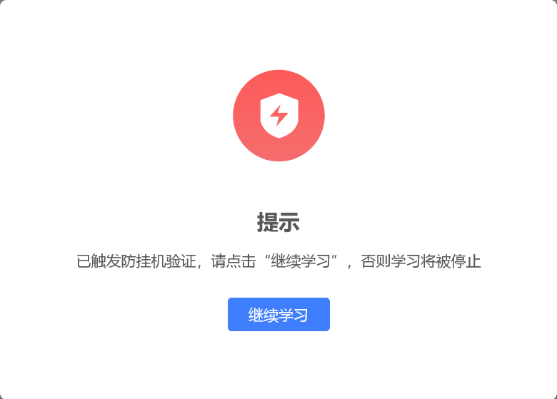

# yunxuetang-oto-script

云学堂企业培训自动继续学习脚本

仅限 `http*://*.yunxuetang.cn/o2o/*/playinfo* `

使用前请确认 url 是否符合.

## 主要功能

触发 "防挂机验证" 时自动点击 "继续学习" 按钮

## 安装

已发布到 Greasy Fork：[云学堂企业培训自动继续学习脚本](https://greasyfork.org/zh-CN/scripts/503822)

## 使用

保持脚本开启, 手动开始播放视频或打开文件后挂机即可